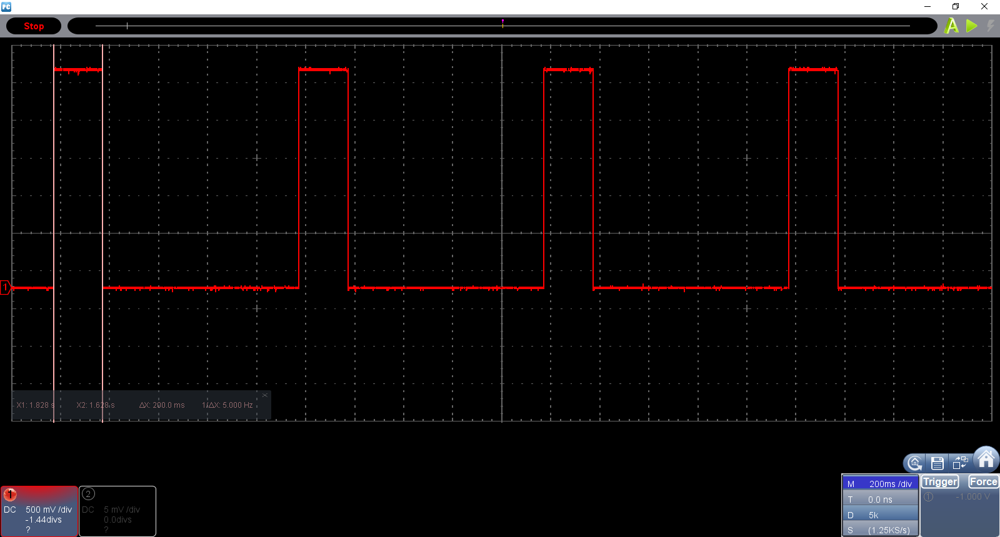

RSENSE20_ANGOSTO_P1
based on [ESP-IDF template](https://github.com/espressif/esp-idf-template) 
====================
Repositorio para la práctica P1 de redes de sensores.

Entregable 1 :
Commit b91e12c, Hardware timer interrupt cada 10s para print por puerto serie lectura ADC.

Entregable 2 :
Commit e439851, implementación comandos ADC, ADC(x) y PWM(x)

Entregable 3 :
Commit 23d7205, lectura IM cada 100 ms, trasmiste por puerto serie cada 1 segundo y encide led durante 200ms.
Durante el encendido del LED continúa la lectura de la IMU, debido a un problema con la gestión de ISR por parte de esp32, la comunicación con la IMU es continúa y cada 100 ms es toma el valor. Se itenta usar IRAM_ATTR para asegurar que las funciones de la ISR estén en la IRAM y por lo tanto sean accesibles pero no se consigue.

---

--David Anogosto
